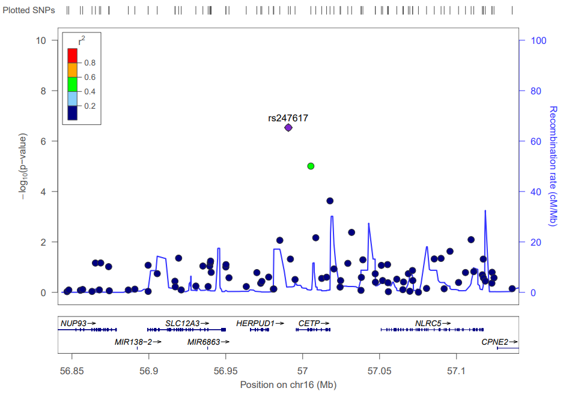
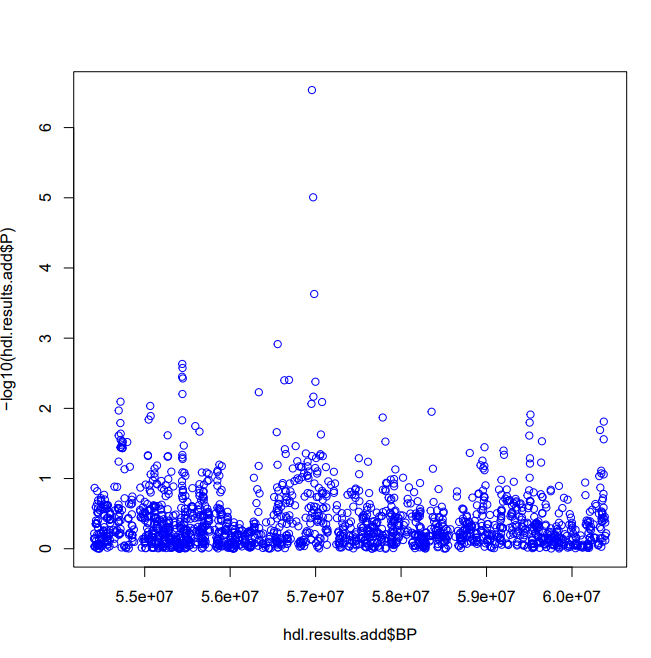
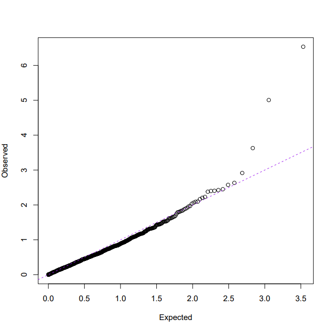
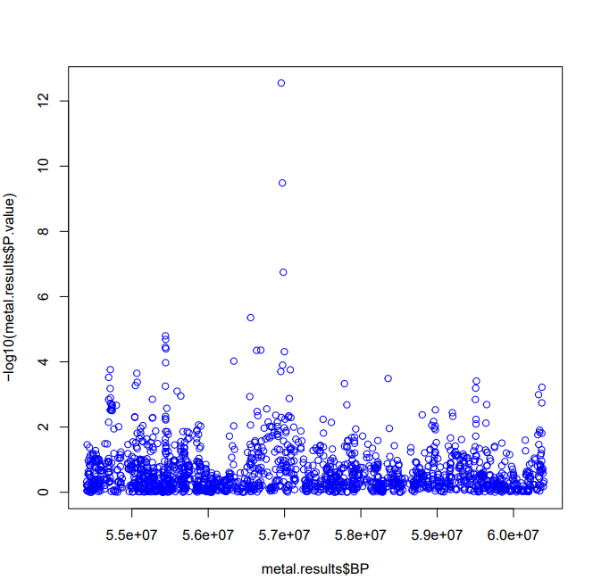
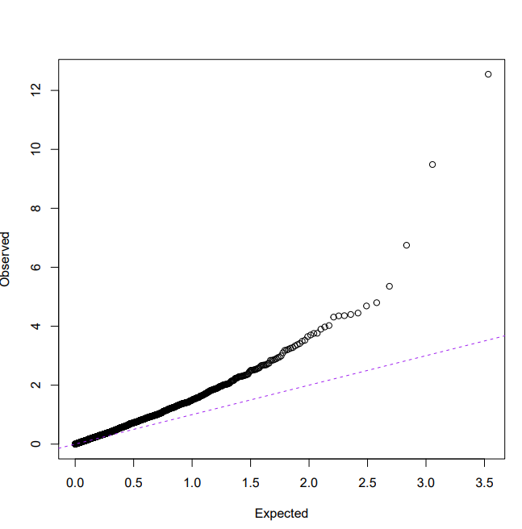

# Genetic Association Analysis of HDL Cholesterol

**PLINK | R | Unix/Linux | Genetic Epidemiology | LocusZoom | METAL | Meta-Analysis**

## Overview

This project presents a genetic association analysis of high-density lipoprotein (HDL) cholesterol conducted as part of graduate coursework in applied genetic methods in public health.

The analysis used **PLINK, R, Unix/Linux, LocusZoom, and METAL** to implement a workflow encompassing genotype quality control, phenotype and covariate preparation, genetic association testing, genomic visualization, regional association analysis, and meta-analysis.

The dataset included **1,000 participants and 1,940 single nucleotide polymorphisms (SNPs) on chromosome 16**. HDL cholesterol was evaluated as the primary quantitative phenotype.

---

## Project Summary

### HDL Cholesterol GWAS and Meta-Analysis

**PLINK | R | Unix/Linux | Genetic Epidemiology | Meta-Analysis**

- Conducted a genetic association analysis of HDL cholesterol levels among 1,000 participants and 1,940 SNPs on chromosome 16.
- Performed genotype quality control using individual and SNP missingness, minor allele frequency, and Hardy-Weinberg equilibrium criteria.
- Conducted SNP-level linear regression adjusting for age and sex and identified **rs247617** as the strongest association signal.
- Performed regional association analysis of the ±150 kb region surrounding the lead SNP, located between **HERPUD1** and **CETP**.
- Generated Manhattan and Q-Q plots and evaluated genomic inflation using the genomic inflation factor (λ).
- Prepared and analyzed genetic association results for meta-analysis and generated post-meta-analysis association diagnostics.

---

## Objectives

The primary objectives of the analysis were to:

- Inspect the structure and dimensions of the genotype dataset.
- Assess individual-level genotype missingness.
- Assess SNP-level genotype missingness.
- Evaluate minor allele frequencies (MAF).
- Assess Hardy-Weinberg equilibrium (HWE).
- Prepare phenotype and covariate files for PLINK.
- Conduct SNP-level association testing for HDL cholesterol.
- Adjust the association model for age and sex.
- Identify the strongest genetic association signal.
- Examine the genomic location of the lead SNP.
- Perform regional association analysis surrounding the lead SNP.
- Generate Manhattan and Q-Q plots.
- Calculate and interpret the genomic inflation factor (λ).
- Prepare association results for genetic meta-analysis.
- Conduct meta-analysis using METAL.
- Evaluate association signals and heterogeneity following meta-analysis.

---

## Dataset

The genetic dataset consisted of:

- **Participants:** 1,000
- **SNPs:** 1,940
- **Chromosome:** 16
- **Primary phenotype:** HDL cholesterol
- **Association covariates:** Age and sex

The PLINK MAP file contained 1,940 SNPs, all located on chromosome 16.

The PED file contained 1,000 rows and 3,886 columns. Each row represented one participant, while the genotype information consisted of two allele columns for each SNP in addition to the six standard PLINK individual-level fields.

Raw genotype and phenotype data are not included in this repository.

---

## Analysis Workflow

The analysis followed the workflow below:

**Genotype Data**  
↓  
**Data Inspection**  
↓  
**Genotype Quality Control**  
↓  
**Phenotype and Covariate Preparation**  
↓  
**PLINK Linear Association Analysis**  
↓  
**Manhattan and Q-Q Plots**  
↓  
**Lead SNP Identification**  
↓  
**Regional Association Analysis**  
↓  
**Meta-Analysis Preparation**  
↓  
**METAL Meta-Analysis**  
↓  
**Post-Meta-Analysis Diagnostics**

Detailed workflow documentation is available in:

[`docs/analysis_workflow.md`](docs/analysis_workflow.md)

---

## Genotype Quality Control

Genotype quality control was conducted using **PLINK and Unix/Linux command-line tools**.

The QC assessment included:

- Individual genotype missingness
- SNP-level genotype missingness
- Minor allele frequency
- Hardy-Weinberg equilibrium

### Individual Missingness

The highest individual missingness rate was:

- **Individual:** A01866
- **Missing genotypes:** 70
- **Total SNPs:** 1,940
- **Missingness rate:** 0.03608
- **Percentage missing:** 3.608%

### SNP Missingness

The SNP with the highest missingness was:

- **SNP:** rs8044753
- **Missing genotypes:** 135
- **Missingness rate:** 0.135
- **Percentage missing:** 13.5%

Five SNPs had missingness rates greater than 10%.

### Minor Allele Frequency

Monomorphic SNPs with MAF = 0 were identified and excluded when evaluating the minimum polymorphic allele frequency.

The minimum non-zero MAF was:

**MAF = 0.0005 (0.05%)**

This corresponds to one minor allele among the 2,000 observed chromosomes in the sample.

### Hardy-Weinberg Equilibrium

Seven SNPs failed Hardy-Weinberg equilibrium at:

**p ≤ 0.0001**

The genotype QC workflow is available in:

[`code/02_genotype_qc.sh`](code/02_genotype_qc.sh)

---

## Genome-Wide Association Analysis

SNP-level association testing was conducted using **linear regression in PLINK**, with HDL cholesterol specified as the quantitative phenotype.

The association model included:

- **Outcome:** HDL cholesterol
- **Covariates:** Age and sex

Phenotype and covariate files were prepared using Unix/Linux commands before conducting the association analysis.

Associated scripts:

- [`code/03_prepare_phenotype_covariates.sh`](code/03_prepare_phenotype_covariates.sh)
- [`code/04_gwas_analysis.sh`](code/04_gwas_analysis.sh)

---

## Lead Association Signal

The strongest association with HDL cholesterol was observed for:

| Characteristic | Result |
|---|---|
| Lead SNP | **rs247617** |
| Chromosome | **16** |
| Position | **56,956,804 bp** |
| Association p-value | **2.92 × 10⁻⁷** |
| Genomic region | **HERPUD1–CETP** |

Examination of the genomic region using the UCSC Genome Browser indicated that **rs247617 lies in the intergenic region between HERPUD1 and CETP** on chromosome 16q13.

HERPUD1 is located upstream of the lead SNP, while CETP is located downstream.

---

## Regional Association Analysis

A regional association analysis was conducted within **±150 kb of rs247617**.

The regional analysis included:

- **85 SNPs**
- **8 genes/transcripts**

The genes and transcripts represented within the region were:

- NUP93
- MIR138-2
- MIR6863
- SLC12A3
- HERPUD1
- CETP
- NLRC5
- CPNE2

The regional association plot was generated using **LocusZoom**.

### Regional Association Plot



The lead SNP, **rs247617**, represented the strongest association signal within the region. Most nearby SNPs showed low linkage disequilibrium with the lead variant, while one nearby SNP showed moderate linkage disequilibrium.

The lead SNP is positioned between **HERPUD1** and **CETP**.

Regional analysis commands are available in:

[`code/06_regional_analysis.sh`](code/06_regional_analysis.sh)

---

## GWAS Diagnostics

Manhattan and Q-Q plots were generated in R to visualize the association results and assess the distribution of association test statistics.

### Manhattan Plot



Most SNPs showed weak or no evidence of association with HDL cholesterol. A smaller number of variants showed stronger association signals, with **rs247617** representing the strongest observed signal.

### Q-Q Plot



Most SNPs followed the expected distribution under the null hypothesis, while several variants in the upper tail deviated from the reference line.

### Genomic Inflation Factor

The genomic inflation factor for the association analysis was:

**λ = 0.82182**

A λ value below 1 indicates deflation of the test statistics. In this analysis, the observed association statistics were generally weaker than expected under the null distribution, suggesting that the analysis may be conservative.

The visualization and genomic inflation calculations are available in:

[`code/05_gwas_visualization.R`](code/05_gwas_visualization.R)

---

## Meta-Analysis

Genetic association results were prepared for meta-analysis by combining PLINK association statistics with allele-frequency information.

The prepared variables included SNP identifiers, allele information, allele frequencies, sample sizes, effect estimates, standard errors, and p-values.

Meta-analysis was subsequently conducted using **METAL**.

The preparation code is available in:

[`code/07_prepare_meta_analysis.R`](code/07_prepare_meta_analysis.R)

### Meta-Analysis Lead Signal

Following meta-analysis, **rs247617 remained the strongest association signal**.

| Characteristic | Result |
|---|---|
| Lead SNP | **rs247617** |
| Meta-analysis p-value | **2.827 × 10⁻¹³** |
| HetISq | **0** |
| HetChiSq | **0** |
| HetDf | **1** |
| HetPVal | **approximately 1** |

The substantially smaller p-value following meta-analysis indicated stronger statistical evidence for the association.

The heterogeneity statistics provided little evidence of heterogeneity between the contributing studies for rs247617.

### Meta-Analysis Manhattan Plot



The strongest association signals became more pronounced following meta-analysis, with rs247617 remaining the lead variant.

### Meta-Analysis Q-Q Plot



The meta-analysis Q-Q plot showed greater upward deviation from the expected distribution.

The genomic inflation factor following meta-analysis was:

**λ = 1.6453**

This value indicates inflation of the association test statistics following meta-analysis.

Post-meta-analysis visualization and diagnostic code is available in:

[`code/08_meta_analysis_visualization.R`](code/08_meta_analysis_visualization.R)

---

## Key Findings

- The dataset contained **1,000 participants and 1,940 SNPs on chromosome 16**.
- Genotype QC identified **five SNPs with missingness greater than 10%**.
- The minimum non-zero MAF was **0.0005**.
- **Seven SNPs** failed HWE at p ≤ 0.0001.
- **rs247617** was the strongest HDL association signal in the individual association analysis.
- rs247617 was located at **chromosome 16:56,956,804 bp** in the **HERPUD1–CETP** region.
- The ±150 kb regional analysis included **85 SNPs and eight genes/transcripts**.
- The initial association p-value for rs247617 was **2.92 × 10⁻⁷**.
- Following meta-analysis, rs247617 remained the strongest signal with **p = 2.827 × 10⁻¹³**.
- The meta-analysis showed little evidence of heterogeneity for the lead SNP.
- Genomic inflation factors were **λ = 0.82182** for the individual association analysis and **λ = 1.6453** following meta-analysis.

---

## Tools and Technologies

- **PLINK** – genotype quality control and SNP-level association testing
- **R** – data processing, visualization, and statistical diagnostics
- **Unix/Linux** – command-line data manipulation and preparation
- **LocusZoom** – regional association visualization
- **METAL** – genetic association meta-analysis
- **UCSC Genome Browser** – genomic annotation of the lead association signal

---

## Repository Structure

```text
hdl-gwas-meta-analysis/
│
├── README.md
├── .gitignore
│
├── code/
│   ├── 01_data_inspection.R
│   ├── 02_genotype_qc.sh
│   ├── 03_prepare_phenotype_covariates.sh
│   ├── 04_gwas_analysis.sh
│   ├── 05_gwas_visualization.R
│   ├── 06_regional_analysis.sh
│   ├── 07_prepare_meta_analysis.R
│   └── 08_meta_analysis_visualization.R
│
├── figures/
│   ├── README.md
│   ├── manhattan_plot.png
│   ├── qq_plot.png
│   ├── regional_association_plot.png
│   ├── meta_manhattan_plot.png
│   └── meta_qq_plot.png
│
├── results/
│   └── README.md
│
└── docs/
    └── analysis_workflow.md

---

## Repository Navigation

- [`code/`](code/) – R, PLINK, and Unix/Linux analysis scripts
- [`figures/`](figures/) – GWAS, regional association, and meta-analysis visualizations
- [`results/`](results/) – Summary of key statistical results
- [`docs/`](docs/) – Detailed analysis workflow documentation

---

## Reproducibility

The repository contains the analysis scripts and documentation required to describe the analytical workflow.

Raw genotype and phenotype data are not distributed with this repository. Therefore, the complete analysis cannot be reproduced directly from the repository without access to the original source data.

The scripts are organized according to the sequence of the original analysis:

1. [`01_data_inspection.R`](code/01_data_inspection.R) – Inspect PLINK genotype data
2. [`02_genotype_qc.sh`](code/02_genotype_qc.sh) – Conduct genotype quality control
3. [`03_prepare_phenotype_covariates.sh`](code/03_prepare_phenotype_covariates.sh) – Prepare phenotype and covariate files
4. [`04_gwas_analysis.sh`](code/04_gwas_analysis.sh) – Conduct SNP-level association analysis
5. [`05_gwas_visualization.R`](code/05_gwas_visualization.R) – Generate GWAS visualizations and calculate λ
6. [`06_regional_analysis.sh`](code/06_regional_analysis.sh) – Prepare regional association results
7. [`07_prepare_meta_analysis.R`](code/07_prepare_meta_analysis.R) – Prepare association statistics for METAL
8. [`08_meta_analysis_visualization.R`](code/08_meta_analysis_visualization.R) – Evaluate and visualize meta-analysis results

See [`docs/analysis_workflow.md`](docs/analysis_workflow.md) for detailed documentation of the analytical workflow.

---

## Author

**Parminder Kooner**

M.S. Biostatistics and Data Science  
Graduate Certificate in Genomics and Bioinformatics  
UTHealth Houston School of Public Health

---
